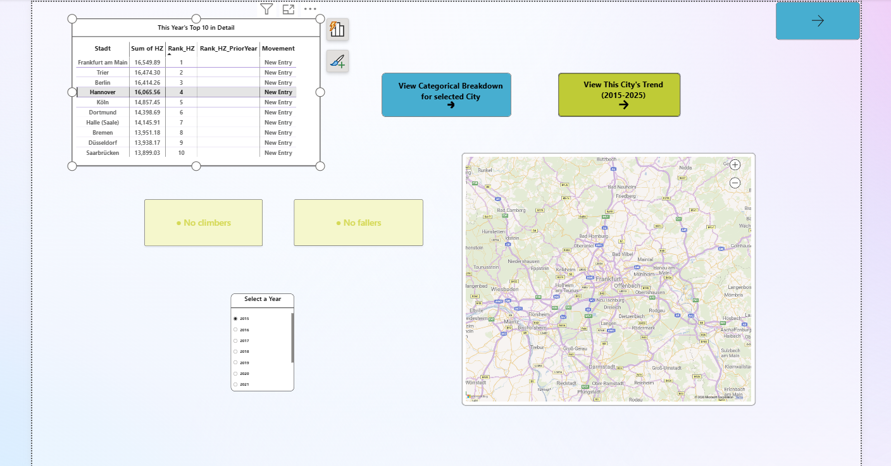
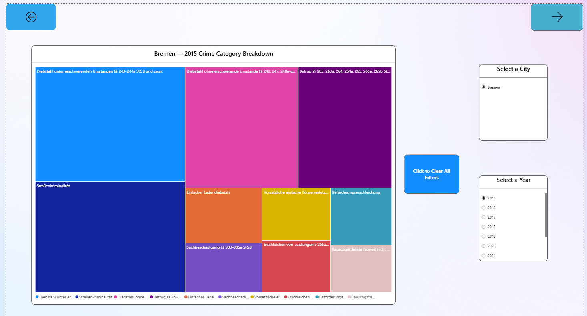
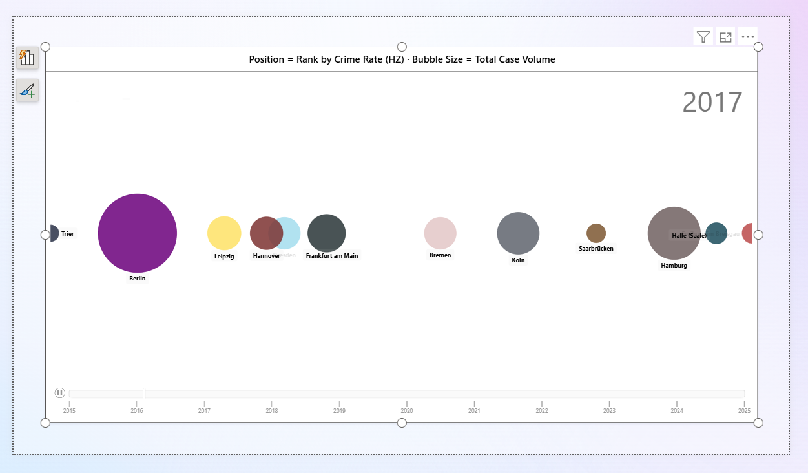
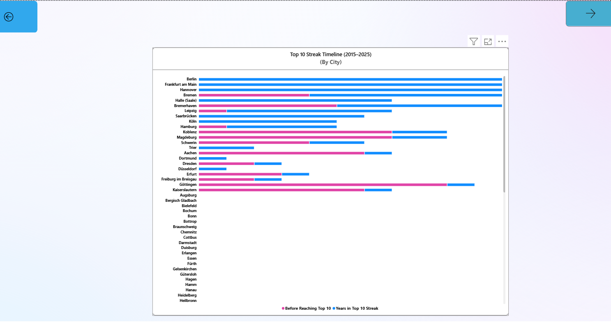
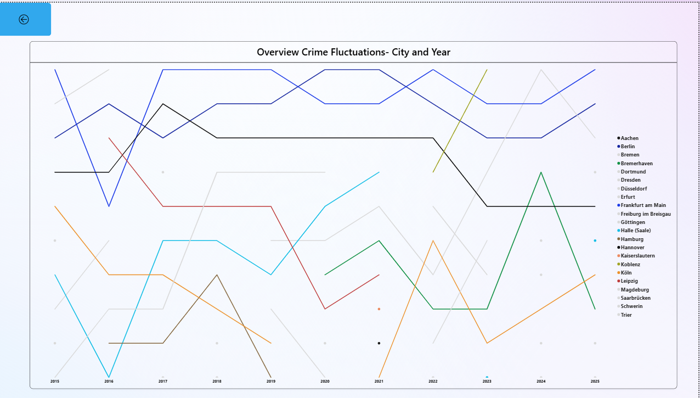
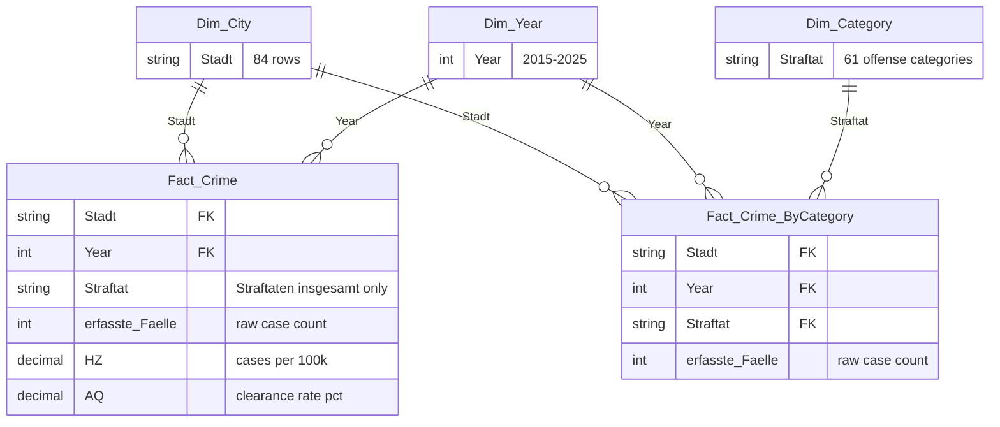

# 🇩🇪 Germany Crime Analytics Dashboard (2015-2025)

**An end-to-end Power BI dashboard tracking crime-rate rankings across 84 major German cities, 2015–2025, built on official BKA (Bundeskriminalamt) statistics.**


---

## Overview

Every year, German Federal Criminal Police Office (Bundeskriminalamt / BKA) publishes the *Polizeiliche Kriminalstatistik* (PKS) — official crime statistics for every major city in Germany that has over 100k+ residents. This project turns 11 years of that raw, structurally inconsistent government data into a fully interactive Power BI dashboard, built around one central question:

> **Which cities are climbing or falling in Germany's crime-rate rankings, and when did it happen?**

Rather than just charting totals, the dashboard's signature feature reconstructs the full **rank history** of every city that has ever appeared in the national Top 10 — tracking exactly when a city entered, climbed, fell, or dropped out entirely, across the full 2015–2025 decade.

The project is built entirely from raw source files with no pre-aggregated input: 11 separate annual Excel exports, each with its own quirks, naming drift, and structural differences, unified into a single verified star schema.

---

## 🏆 Signature Feature: Decade-Long Rank Tracking

Three cities — **Berlin, Frankfurt am Main, and Hannover** — have held a Top 10 crime-rate ranking for **all 11 consecutive years** in the dataset, a fact surfaced directly by a custom gaps-and-islands DAX pattern (`Years in Top 10 Streak`), which is not hardcoded.

The dashboard visualizes this at three different levels of detail:

| Visual | What it shows |
|---|---|
| **Bump Chart** | Every ever-ranked city's full 11-year trajectory in one static view — climbs, falls, entries, exits |
| **Animated Rank Race** | Year-by-year Top 10 positions animated via Power BI's native Play Axis, bubble size scaled to actual case volume |
| **Streak Timeline** | A Gantt-style view of exactly which calendar years each city's longest unbroken Top 10 run covers |

A real, verified example the data surfaces on its own For eg.,: **Schwerin** ranked #9 in 2024, then has **zero recorded rows at all** in the 2025 source file — a genuine reporting gap in the official statistics, not a dashboard error. The dashboard detects this automatically per-city via DAX and surfaces an explanatory note, rather than silently showing a misleading blank.

---

## 📊 Screenshots

**Main Metrics** — current year's Top 10, biggest climber/faller KPIs, and the #1 city on the map


**Category Breakdown** — offense-category treemap for any selected city and year


**City & Yearwise Breakdown** — full 11-year HZ trend for a single city, with automatic data-gap detection (shown here for Schwerin, which has no reported 2015 or 2025 data)


**TOP 10 Rank Race (Animated)** — Play-Axis animation of Top 10 rank positions by year, bubble size scaled to real case volume


**Longest Streak Timeline** — Gantt-style view of exactly which years each city's longest Top 10 streak covers


**Bump Chart Overview** — full-decade rank trajectory for every ever-ranked city in one static view


---

## 🗂 Data Source

- **Publisher**: Bundeskriminalamt (BKA) — Germany's Federal Criminal Police Office
- **Dataset**: *Polizeiliche Kriminalstatistik (PKS)*, Table T01 — "Grundtabelle: Fälle mit Häufigkeitszahl (HZ) — Städte"
- **Coverage**: 84 German cities (Großstädte ≥100,000 residents + all state capitals), 2015–2025 (Some states are city capitals in Germany for eg., Hamburg, Berlin)
- **Ranking metric**: **Häufigkeitszahl (HZ)** — cases per 100,000 residents, not raw case counts. This normalizes for population size, so a city's HZ rank reflects genuine relative crime rate, not simply population-driven volume.
- **Files**: 11 annual `.xlsx` exports, one per year (`YYYY_Staedte_Faelle_HZ.xlsx`)

Crime statistics are public data published for civic transparency. This project performs independent analysis for portfolio/educational purposes; refer to the [BKA](https://www.bka.de) for official terms governing redistribution of the underlying dataset.

---

## 🏗 Architecture: Star Schema



**Design principle**: `Fact_Crime` holds one row per city per year (the `"Straftaten insgesamt"` rollup only), used for all ranking/trend analysis. `Fact_Crime_ByCategory` retains full offense-category detail from the same source files, powering the category-breakdown drillthrough without duplicating the ranking logic across two different grains.

---

## 🧮 DAX Highlights

A few measures that go beyond basic aggregation:

**Gaps-and-islands streak detection** — finds each city's longest unbroken run inside the Top 10, and the exact calendar years it covers:
```dax
'Years in Top 10 Streak' =
VAR YearsInTop10 =
    FILTER(
        ADDCOLUMNS(ALL(Dim_Year[Year]), "Rank", CALCULATE([Rank_HZ])),
        [Rank] <= 10
    )
-- Groups consecutive years into "islands" and returns the longest island's length.
-- StreakStartYear / StreakEndYear apply the same pattern to return the exact
-- calendar years the longest streak covers, powering the Gantt-style timeline.
```

**Dynamic movement classifier** — converts a rank delta into plain-language text:
```dax
Movement =
VAR CurrentRank = [Rank_HZ]
VAR PriorRank   = [Rank_HZ_PriorYear]
RETURN
SWITCH(
    TRUE(),
    ISBLANK(PriorRank) && NOT ISBLANK(CurrentRank), "New Entry",
    CurrentRank > 10, "Not in Top 10",
    PriorRank > CurrentRank, "Climbed " & (PriorRank - CurrentRank),
    PriorRank < CurrentRank, "Fell " & (CurrentRank - PriorRank),
    "No Change"
)
```

**Self-documenting data-quality detection** — automatically flags any year a selected city has no reported data for, rather than silently rendering a misleading gap:
```dax
MissingYearsMessage =
VAR CurrentCity = SELECTEDVALUE(Dim_City[Stadt])
VAR MissingYearsTable =
    FILTER(
        ADDCOLUMNS(ALL(Dim_Year[Year]), "HasData",
            CALCULATE(NOT ISBLANK(SUM(Fact_Crime[HZ])), Dim_City[Stadt] = CurrentCity)),
        [HasData] = FALSE()
    )
RETURN
IF(COUNTROWS(MissingYearsTable) = 0,
    "✓ Complete BKA data available for all years (2015–2025).",
    "⚠ " & CurrentCity & " has no BKA-reported data for: " &
        CONCATENATEX(MissingYearsTable, [Year], ", ", [Year], ASC))
```

---

## 📄 Report Pages

| Page | Purpose |
|---|---|
| **Main Metrics** | Current year's Top 10 table, map of the #1 city, biggest climber/faller KPI cards, navigation into the two drillthrough pages below |
| **Category Breakdown** | Treemap of offense categories for any city + year, reachable via drillthrough *or* standalone slicers |
| **City & Yearwise Breakdown** | Full 11-year HZ trend for any single city, with case-count and clearance-rate detail on hover |
| **TOP 10 Rank Race (Animated)** | Play-Axis animated scatter chart racing all 10 cities' positions year by year |
| **Longest Streak by Years** | Streak length per city, plus a Gantt-style timeline of exactly which years each streak covers |
| **Bump Chart (Crime fluctuations- Overall Top cities)** | The full-decade rank trajectory for every ever-ranked city in one static view |

---

## 🧭 Navigation Walkthrough

The six report pages aren't a linear sequence — every drillthrough page can be reached from at least two different interaction paths (a dedicated button, native right-click drillthrough, or a tooltip-level drillthrough on a specific data point), and several support the reverse journey too.

**[📄 Read the full Navigation & Drillthrough Walkthrough (PDF)](./WALKTHROUGH.pdf)** — a step-by-step, screenshot-illustrated tour of exactly how the pages connect, including the 2015 "New Entry" baseline behavior and a source-verified drillthrough example (Trier, 2016).

---

## ⚠️ Known Data Limitations

Documented deliberately, not hidden — a dataset built from real government publications has real seams:

- **Category granularity differs by era**: ~13 offense categories in 2015–2018 files vs. ~40 in 2019–2025, reflecting a genuine BKA reporting change, not a data-loading error.
- **Legal reform breaks in comparability**: the 2016 sexual-offence law reform and 2024 cannabis decriminalization both changed what counts as a reportable offense mid-dataset.
- **2015 has no 2014 baseline**: year-over-year rank movement cannot be calculated for the first year in the dataset — this is a structural limitation of the data window, not a bug.
- **City roster changes year to year**: cities cross the 100,000-resident threshold (or state-capital status) at different points; entries and exits in the roster are real, not errors.
- **Rostock naming inconsistency**: appeared under two different official spellings across source files (`Rostock` vs. `Rostock, Hanse- und Universitätsstadt`); standardized during data load.
- **A verified, non-obvious real spike**: Koblenz's 2023 crime rate jumped +21.4% — confirmed as a genuine reporting event via the BKA's own change-flag documentation, not a data artifact.
- **Data Source language** : German by choice, not by necessity. All 11 source files in this project were deliberately downloaded in German. The BKA also publishes its statistics in English for every year covered here , via its dedicated [English-language statistics section](https://www.bka.de/EN/CurrentInformation/Statistics/PoliceCrimeStatistics/policecrimestatistics_node.html). German was selected as a preference — closer to the original source terminology and easier to cross-reference against the BKA's own German-language documentation.

---

## 📁 Repository Structure

```
.
├── Germany_Crime_Analysis.pbix              # Main Power BI report — single-file format, fully self-contained
├── Germany_Crime_Analysis.pbip              # PBI project entry point — PBIR (folder-based) format, opens the two folders below
├── Germany_Crime_Analysis.Report/           # Report definition — pages, visuals, bookmarks as individual JSON files
├── Germany_Crime_Analysis.SemanticModel/    # Data model definition — tables, relationships, DAX measures as TMDL files
├── Dataset/
│   ├── 2015_Staedte_Faelle_HZ.xlsx
│   ├── 2016_Staedte_Faelle_HZ.xlsx
│   ├── ...
│   └── 2025_Staedte_Faelle_HZ.xlsx
├── Screenshots/
│   ├── 01_main_metrics.png
│   ├── 02_Category_Wise_Breakdown.png
│   ├── 03_City and Yearwise_statistic.png
│   ├── 04_TOP10_Cities_Rank_shift.png
│   ├── 05_Longest_Streak.png
│   └── 06_Bump_Chart_Overview.png
├── WALKTHROUGH.pdf                          # Navigation
├── LICENSE                                  
└── README.md                                # This file
```

`Germany_Crime_Analysis.pbip` and the `.Report`/`.SemanticModel` folders are the newer **PBIR** format: the same report and model as the `.pbix`, but split into human-readable, git-diffable JSON/TMDL files. Either one opens the identical dashboard in Power BI Desktop — the `.pbix` needs no other file in this repo, while the `.pbip` needs both folders alongside it.

---

## 🚀 Getting Started (How to..)

1. Install [Power BI Desktop](https://powerbi.microsoft.com/desktop/) (free, Windows only).
2. Clone this repository.
3. Open `Germany_Crime_Analysis.pbix` (or `Germany_Crime_Analysis.pbip`, if you'd rather work with the PBIR project files).
4. All 11 source files are included in `/Dataset` — no external connection or refresh required to explore the report as-is.

---

## 🛠 Tech Stack

- **Power BI Desktop** — data modeling, DAX, report/visual design
- **Power Query (M)** — multi-era file ingestion, cleaning, standardization
- **DAX** — ranking, gaps-and-islands streak detection, dynamic titles, data-quality self-checks
- **Python (openpyxl)** — independent verification of every headline figure against raw source data during development

---

## 📬 Author

*Abhishek Bangale*

---

## 📜 License

Code and report design: [MIT](LICENSE). Underlying crime statistics are published by the BKA for public transparency — see the [BKA website](https://www.bka.de) for terms governing use of the source data itself.
